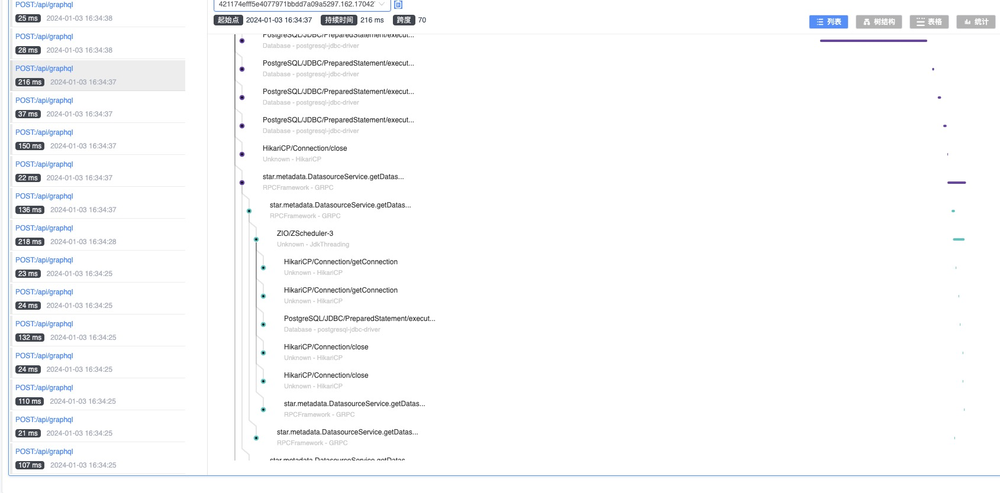

SkyWalking Extension Plugins for Scala 3
---

[![Project stage][Badge-Stage]][Badge-Stage-Page] 
![CI][Badge-CI]

[Badge-CI]: https://github.com/hjfruit/skywalking-scala/actions/workflows/ScalaCI.yml/badge.svg
[Badge-Stage]: https://img.shields.io/badge/Project%20Stage-Development-yellowgreen.svg
[Badge-Stage-Page]: https://github.com/bitlap/bitlap/wiki/Project-Stages

> Still in the experimental stage, there may be some minor issues related to work steal, especially for ZIO and Cats-Effect.

## Environment

- Java 11
- Scala 3.3.0
- SkyWalking 9.1.0

## Example

## Available Plugins

[SkyWalking Scala](https://github.com/bitlap/skywalking-scala) is a SkyWalking Extension (Agent) Plugins for Scala 3.

| plugin                 | library                                   | Enhance Targets                                                                                                                            | maybe support version   | tested version     |
|------------------------|-------------------------------------------|--------------------------------------------------------------------------------------------------------------------------------------------|-------------------------|--------------------|
| cats-effect-v3x-plugin | cats-effect                               | `cats.effect.IOFiber`                                                                                                                      | 3.4.0-RC1 ~ 3.5.x       | 3.4.1              |
| zio-v2x-plugin         | zio                                       | `zio.internal.FiberRuntime`, `zio.Executor`                                                                                                | 2.0.3 ~ 2.0.x           | 2.0.9,2.0.13       |
| ziogrpc-v06rcx-plugin  | zio-grpc                                  | 1. Client: `scalapb.zio_grpc.ZChannel`  2. Server: `scalapb.zio_grpc.server.ZServerCall`, `scalapb.zio_grpc.server.ZServerCallHandler` | 0.6.0-test6 ~ 0.6.0-RC5 | 0.6.0-RC5          |
| ziohttp-v2x-plugin     | zio-http                                  | `zhttp.http.Http$PartialCollectHttp$`                                                                                                      | 2.0.0-RC2 ~ 2.0.0-RC11  | 2.0.0-RC10         |
| caliban-v2x-plugin     | caliban                                   | `caliban.GraphQLInterpreter`, `caliban.wrappers.Wrapper`                                                                                   | 2.0.0 ~ 2.0.2           | 2.0.1              |
| executors-plugin       | `java.util.concurrent.ThreadPoolExecutor` | `submit`, `schedule`, `schedule`                                                                                                           | -                       | -                  |
| ziocache-plugin        | zio-cache                                 | `zio.cache.Cache`                                                                                                                          | Not Implementation      | Not Implementation |

> Other small versions of the library supported by this plugin may also work, but they have not been tested.

These plugins can be used together with the following plugins, tested by me:
- `apm-hikaricp-3.x-4.x-plugin-*.jar`
- `apm-jackson-2.x-plugin-*.jar`
- `apm-jdbc-commons-*.jar`
- `apm-jdk-forkjoinpool-plugin-*.jar`
- `apm-jdk-threading-plugin-*.jar`
- `apm-lettuce-5.x-plugin-*.jar`
- `apm-mysql-8.x-plugin-*.jar`
- `apm-mysql-commons-*.jar`
- `apm-postgresql-8.x-plugin-*.jar`
- `apm-pulsar-2.8.x-plugin-*.jar`
- `apm-pulsar-common-*.jar`
- and so on ...

>  `apm-ziogrpc-v06rcx-plugin-*.jar` should never be used together with `apm-grpc-1.x-plugin-*.jar`.

## Available Configurations
| key                                             | description                                                                                                                                            |
|-------------------------------------------------|--------------------------------------------------------------------------------------------------------------------------------------------------------|
| `plugin.ziov2.ignore_fiber_regexes`             | Ignore ZIO Fibers by `FiberId.location` which match this regex, i.e. no span will be created, default is empty. **Allow commas to separate multiple**. |
| `plugin.calibanv2.url_prefix`                   | Add a custom prefix to the graphql operation, default is `Caliban/GraphQL/`.                                                                           |
| `plugin.calibanv2.ignore_url_prefixes`          | Ignore operation names starting with this prefix, i.e. no span will be created. **Allow commas to separate multiple**.                                 |
| `plugin.calibanv2.collect_variables`            | Collect request variables.                                                                                                                             |
| `plugin.calibanv2.variables_length_threshold`   | How many characters to keep and send to the OAP backend.                                                                                               |
| `plugin.ziohttpv2.ignore_url_prefixes`          | Ignore request paths starting with this prefix, i.e. no span will be created. **Allow commas to separate multiple**.                                   |
| `plugin.ziohttpv2.collect_http_params`          | Collect http query params.                                                                                                                             |
| `plugin.ziohttpv2.http_params_length_threshold` | How many characters to keep and send to the OAP backend.                                                                                               |

The prefix should be added when passing command line parameters, such as: `-Dskywalking.plugin.calibanv2.url_prefix=GQL/`

## How to start

1. Clone code `git clone https://github.com/bitlap/skywalking-scala.git`.
2. Enter the source file directory `cd skywalking-scala`.
3. Build plugins: `sh scenarios/packageJars.sh`. 
4. Copy the `scenarios/skywalking-agent/plugins/*.jar` to skywalking plugins folder. (Copy on demand)

Please check the official documents for specific information
[skywalking.apache.org/docs](https://skywalking.apache.org/docs/skywalking-java/v8.15.0/en/setup/service-agent/java-agent/readme/)

## Scenarios

> It needs docker & docker-compose

1. `sh scenarios/runExamplesOnDocker.sh`
2. `curl http://localhost:8090/hello`
3. Open in browser: `http://localhost:8080/general`
